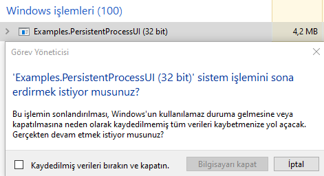

# OverClick.PersistentProcess // By [@overclickofficial](https://t.me/overclickofficial)
# .NET Dilleri için Kalıcı İşlem Kütüphanesi!
### UYARI: Bu Kalıcı işlem Aktif İken Programınızdaki Herhangi Bir Çökme yada Elle Kapatma Durumunda Bilgisiyarınız Mavi Ekran Vermesine Sebep Olacaktır Deneme Yaparken Yada Kullanıcıya Sunmadan Önce Kodlarınızı İyi Bir Kontrolden Geçirin.
### UYARI: Bu Kütüphanenin Kullanımından Doğabilecek Sorunlardan yada Kötüye Kullanımından Yapan Kişi Sorumlu Tutulamaz!

## Ekran Görüntüleri


## Nasıl Kullanılır?
#### VB .Net 
#### Kalıcı İşlemi Aktif Etme
```
Imports OverClick.PersistentProcess

...

Dim persistproc As New PersistentProcess
persistproc.YetkiAl()
persistproc.KaliciON()
```

#### VB .Net 
#### Kalıcı İşlemi Devre Dışı Bırakma
```
Imports OverClick.PersistentProcess

...

Dim persistproc As New PersistentProcess
persistproc.YetkiAl()
persistproc.KaliciOFF()
```

> C# Kodları Çok Yakında

> Kullanım Videosu Çok Yakında

## Telegram Grubumuza Katılmayı Unutmayın! https://t.me/overclickofficial
